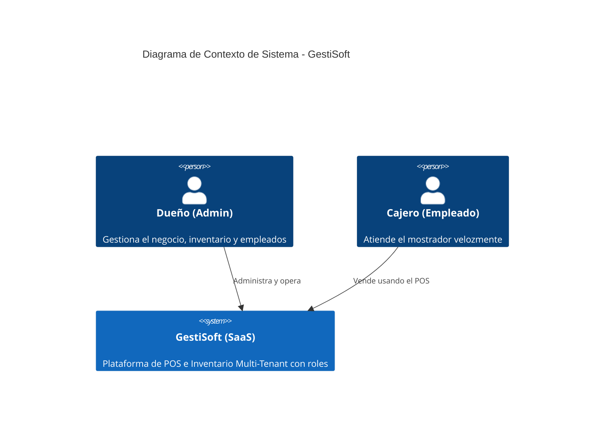

# GUÍA DE TRABAJO EN EQUIPO - Semana 6 (Plan de Incremento 1)
## Reorientar y diseñar el incremento funcional 1

**RESULTADO:** Arquitectura y plan del Incremento 1 (Gestión de Roles)
**ENTRADA:** Primera demostración y defensa
**DEFENSA:** Semana 10

---

### 1. Propósito y resultados esperados
La Semana 6 transforma la retroalimentación de la primera defensa en un objetivo de incremento, una arquitectura suficiente para construirlo y un plan verificable para las semanas 7 a 9.

| Elemento | Definición de trabajo |
| :--- | :--- |
| **Aprender** | Convertir observaciones de la defensa en decisiones y acciones trazables. |
| **Enfocar** | Definir el resultado, la hipótesis de valor, el flujo prioritario y los límites. |
| **Diseñar** | Asignar responsabilidades a componentes, contratos y datos según drivers reales. |
| **Planificar** | Ordenar PBIs, riesgos, spikes, revisiones y evidencia para las semanas 7 a 9. |

---

### 2. Retroalimentación de la primera defensa

| ID | Categoría | Observación verificable | Impacto | Decisión o acción |
| :--- | :--- | :--- | :--- | :--- |
| OBS-01 | Seguridad | La URL del inventario (`/inventory`) era accesible para cualquier usuario autenticado, sin distinguir cargo. | Alto | Implementar control de accesos (Middleware) en backend y ocultar vistas en frontend. |
| OBS-02 | Producto | Las cuentas tenían privilegios absolutos por defecto, exponiendo costos de inventario. | Alto | Desarrollar CRUD de Usuarios (PBI-04) donde el Admin asigne el rol "Cajero". |
| OBS-03 | Técnica | La navegación por teclado en el POS pierde el foco al mostrar alertas. | Medio | Ajustar manejo de estados y autofocus en React/Inertia. |

---

### 3. Retrospectiva del equipo

| Tipo | Práctica o problema | Acción verificable | Responsable y fecha |
| :--- | :--- | :--- | :--- |
| Mantener | Desarrollo aislado por funcionalidad. | Continuar usando ramas `feat/PBI-X` para cada incremento. | Todo el equipo |
| Corregir | Integración sin validación de seguridad estricta. | Todo PR incluirá prueba manual de intercepción de URLs protegidas. | Alan Troncoso · S7 |
| Detener | Ocultar botones asumiendo que eso protege el sistema. | Ningún cambio visual se aprueba sin validación en el Backend. | Luis Barrios |
| Comenzar | Pruebas de rol cruzado localmente. | Probar sesión Admin vs Cajero antes de cada *merge*. | Rodrigo Bertolini · S8 |

---

### 4. Objetivo del Incremento Funcional 1

| Elemento | Definición |
| :--- | :--- |
| Usuario y contexto | El dueño de la PYME (Admin) y su empleado de mostrador (Cajero) operando el mismo sistema. |
| Resultado | Restringir los accesos operativos: el Cajero solo puede vender en el POS; el Admin gestiona inventario y personal. |
| Límite | Uso de dos roles estáticos (Admin, Cajero) sin motor de permisos granulares complejos. |
| Evidencia | Al iniciar sesión como Cajero, el menú de inventario no existe en el DOM y forzar la URL arroja HTTP 403. |

---

### 5. Hipótesis de valor y señal de éxito

| ID | Hipótesis | Señal observable | Decisión según resultado |
| :--- | :--- | :--- | :--- |
| H-01 | Si restringimos el acceso al inventario y reportes, el dueño confiará en delegar la operación de caja. | 100% de los intentos de acceso a rutas protegidas por un Cajero devuelven HTTP 403. | Si falla, detener nuevos desarrollos hasta asegurar el Middleware. |

---

### 6. Alcance y flujo prioritario

| Categoría | Capacidades | Justificación |
| :--- | :--- | :--- |
| Incluye | Columna de roles en BD, Middleware en Laravel, Inyección Inertia, CRUD de usuarios. | Fundamental para proteger datos financieros del negocio. |
| Posterga | PBI-03 (Cierre Caja) y PBI-05 (Dashboard). | Se postergan para estabilizar la seguridad y no saturar la capacidad técnica del equipo. |
| Excluye | Recuperación de contraseñas vía Email. | Evitar dependencias de servidores SMTP en esta etapa. |

| ID | Tipo | Recorrido | Resultado observable |
| :--- | :--- | :--- | :--- |
| F-01 | Normal | Admin inicia sesión → Va a Usuarios → Crea Cajero → Cajero inicia sesión. | Cuenta creada con rol restringido y menú simplificado. |
| F-02 | Seguridad| Cajero inicia sesión → Escribe la ruta `/inventory` en el navegador. | Bloqueo absoluto y pantalla de Error 403. |

---

### 7. Refinamiento del Product Backlog

| Orden | ID | Resultado del ítem | Justificación | Tamaño |
| :--- | :--- | :--- | :--- | :--- |
| 1 | SPIKE-02 | Definir paso del estado "Rol" desde Laravel a React. | Reduce riesgo de menús parpadeantes o exposición de componentes. | 3 hrs |
| 2 | PBI-04 | CRUD de Usuarios y Roles (Middleware). | Satisface necesidad de control de accesos. | 5 pts |
| Fuera | PBI-03 | Módulo Caja: Arqueo y cierre de turno. | Postergado al Incremento 2 por capacidad técnica. | — |
| Fuera | PBI-05 | Dashboard Estadístico. | Postergado por depender de un volumen alto de ventas previas. | — |

---

### 8. Criterios de aceptación actualizados

| ID | Tipo | Dado | Cuando | Entonces |
| :--- | :--- | :--- | :--- | :--- |
| AC-08 | Normal | Un Administrador en Gestión de Usuarios. | Registra un nuevo empleado como "Cajero". | Se crea el usuario en el mismo Tenant con rol restringido. |
| AC-09 | Seguridad| Un usuario con rol "Cajero" ha iniciado sesión. | Intenta acceder al endpoint/ruta del Inventario. | El sistema devuelve error "Acceso Denegado" (HTTP 403). |
| AC-12 | Interfaz | Un usuario con rol "Cajero" ha iniciado sesión. | Visualiza la barra de navegación principal. | Las opciones de "Inventario" y "Usuarios" no se renderizan en el DOM. |

---

### 9. Drivers arquitectónicos

| ID | Tipo | Driver | Consecuencia arquitectónica |
| :--- | :--- | :--- | :--- |
| DA-01 | Seguridad | Empleados no deben ver costos base del negocio. | Las validaciones deben ejecutarse en el servidor (Laravel Middleware). |
| DA-02 | Usabilidad| La interfaz no debe mostrar enlaces inutilizables. | Inertia inyectará el objeto de sesión (rol) globalmente en el renderizado. |

---

### 10. Contexto del sistema

| Actor o sistema | Tipo | Interacción | Alcance |
| :--- | :--- | :--- | :--- |
| **Administrador (Dueño)** | Persona | Administra usuarios, visualiza inventario, costos y opera la caja. | Acceso total a los módulos dentro de su propio Tenant. |
| **Cajero (Empleado)** | Persona | Realiza ventas operando exclusivamente el Punto de Venta (POS). | Sin acceso a gestión del negocio, reportería ni costos base. |
| **GestiSoft** | Sistema SaaS | Procesa autenticación, valida roles, maneja inventario y POS. | Sistema Core (Laravel + React) central. |

---

### 11. Contenedores y responsabilidades

| Contenedor | Tipo | Responsabilidad | Se relaciona con |
| :--- | :--- | :--- | :--- |
| React UI (Inertia) | Frontend | Renderiza componentes condicionalmente según el rol inyectado. | Laravel Backend |
| Laravel Backend | Aplicación | Controla sesión, verifica roles mediante Middleware e impide consultas. | UI y MySQL |
| MySQL Database | Base Datos | Almacena perfiles, `tenant_id` y el estado del `role`. | Laravel Backend |

---

### 12. Componentes y límites internos

| Componente | Contenedor | Responsabilidad | Límite explícito |
| :--- | :--- | :--- | :--- |
| `RoleMiddleware` | Backend | Intercepta HTTP y verifica el permiso del usuario autenticado. | No maneja lógica visual, solo retorna 403 o continúa la petición. |
| `UserController` | Backend | Lógica para listar y crear empleados. | Accesible únicamente si el Middleware aprueba el rol Admin. |
| `HandleInertiaRequests`| Backend | Inyecta el objeto Auth y Rol en todas las vistas React. | Usa el objeto de sesión en memoria, no hace queries extra. |

---

### 13. Contratos e interfaces

| Contrato | Entrada | Salida | Errores controlados | Enlaces |
| :--- | :--- | :--- | :--- | :--- |
| POST `/users` | `{ name, email, password, role }` | `201 Created` | `403 FORBIDDEN` (Si lo intenta Cajero), `422 VALIDATION` | AC-08 |
| GET `/inventory`| Petición de vista | `200 OK` (Vista React) | `403 FORBIDDEN` (Si el rol autenticado es Cajero) | AC-09 |

---

### 14. Modelo conceptual de datos

| Entidad | Atributos necesarios | Relaciones | Restricciones |
| :--- | :--- | :--- | :--- |
| `User` | `id`, `tenant_id`, `name`, `email`, `password`, `role` | Pertenece a un `Tenant`. | `role` solo admite 'admin' o 'cajero'. Email único general. |
| `Tenant` | `id`, `name` | Tiene muchos `Users`. | Aislamiento estricto multi-tenant (SPIKE-01). |

---

### 15. Escenarios de atributos de calidad

| ID | Atributo | Condición | Respuesta | Medida | Método |
| :--- | :--- | :--- | :--- | :--- | :--- |
| RNF-SEC-02 | Seguridad| Cajero manipulando peticiones web/AJAX a rutas de inventario. | El servidor rechaza la petición sin exponer datos del Tenant. | 100% de rechazo HTTP 403. | Pruebas de integración E2E / Manual. |
| RNF-ACC-02 | UX | Renderizado inicial de React. | Carga inmediata sin parpadeos de menús prohibidos. | Inyección Inertia < 50ms. | Inspección React DevTools. |

---

### 16. Registro de decisión arquitectónica

| Campo | Contenido |
| :--- | :--- |
| ID y estado | ADR-02 · Aceptada |
| Contexto | Diferenciar permisos entre dueño (Admin) y empleado (Cajero) en un sistema SaaS. |
| Alternativas | 1. Paquete ACL (`spatie/laravel-permission`). 2. Columna `role` nativa tipo ENUM/String en tabla `users`. |
| Decisión | Utilizar la alternativa 2 (Columna `role`) implementando Middlewares nativos. |
| Consecuencias| Mantiene BD ligera, evita sobrecarga de consultas JOIN, reduce tiempos. Requiere programación manual del Middleware. |
| Revisar cuando | La PYME demande creación de roles personalizados dinámicos. |

---

### 17. Spike técnico

| Campo | Contenido |
| :--- | :--- |
| ID | SPIKE-02 |
| Pregunta | ¿Cómo inyectar de forma segura el rol del usuario desde Laravel hacia React globalmente? |
| Límite | 3 horas; revisión de documentación oficial Inertia (Shared Data). |
| Evidencia | Implementación en `HandleInertiaRequests` verificada en React DevTools sin exponer claves. |
| Responsable| Leonel Ayala · Lunes Semana 7. |

---

### 18. Riesgos prioritarios

| ID | Tipo | Riesgo | Nivel | Respuesta | Responsable |
| :--- | :--- | :--- | :--- | :--- | :--- |
| RSK-04 | Seguridad| Ocultar botones pero olvidar proteger la ruta backend (Falso aislamiento). | Alta | Middleware aplicado en el archivo de rutas `web.php` (no en constructores). | Alan Troncoso |
| RSK-05 | Operativo| Un Admin cambia su propio rol a Cajero bloqueándose accidentalmente. | Media | Backend bloquea edición del campo `role` si coincide con el ID autenticado. | Luis Barrios |

---

### 19. Plan de construcción de las semanas 7 a 9

| Semana | Ítems | Resultado | Evidencia | Coordina | Revisa |
| :--- | :--- | :--- | :--- | :--- | :--- |
| 7 | SPIKE-02, PBI-04 (Migración) | BD actualizada y rol inyectado globalmente en Inertia. | PR backend, pruebas en consola. | Leonel A. | Rodrigo B. |
| 8 | PBI-04 (Middleware, UI) | Admin crea cuentas, Middleware expulsa accesos indebidos. | PR, pruebas HTTP 403, UI condicional. | Alan T. | Luis B. |
| 9 | RC-01 (Versión Candidata) | Versión integrada libre de brechas de permisos. | Tag en repositorio, pruebas manuales de roles cruzados. | Luis B. | Leonel A. |

---

### 20. Revisión cruzada

| ID | Prueba aplicada | Observación | Artefacto afectado | Acción |
| :--- | :--- | :--- | :--- | :--- |
| **REV-01** | Inicio de sesión con Cajero y navegación. | El frontend ocultó los menús (bien), pero forzando la URL el backend no protegió la ruta de inventario. | `web.php` (Rutas) | Crear y aplicar `RoleMiddleware` a todo el grupo de rutas protegidas. |
| **REV-02** | Acceso forzado vía URL `/users` por un Cajero. | Se obtenía error HTTP 403 correctamente sin filtrar información. | `RoleMiddleware.php` | Test de seguridad de aceptación aprobado (AC-09). |

---

### 21. Bitácora individual

| Integrante | Contribución | Efecto | Evidencia | Aprendizaje |
| :--- | :--- | :--- | :--- | :--- |
| **Rodrigo Bertolini** | Reorientó el alcance (Fase 2) para incluir roles excluyendo temporalmente el tablero estadístico. | Foco claro en la seguridad y administración del PBI-04. | Plan de Incremento 1 (Semana 6). | El feedback de una defensa (OBS-02) reordena prioridades inmediatamente hacia el mayor riesgo. |
| **Luis Barrios** | Diseñó la lógica visual condicional en React. | Interfaz limpia según el rol, sin exponer accesos restringidos (DOM). | Componentes `Navigation.jsx` e Inyección de estado Inertia. | React debe ocultar lo visual por UX, pero no debe ser la única ni última capa de seguridad. |
| **Leonel Ayala** | Backend Middleware y BD de Roles. | Blindaje absoluto en el servidor contra accesos HTTP no autorizados. | `RoleMiddleware.php`, Migraciones, Rutas en `web.php`. | Separación de responsabilidades: La seguridad verdadera recae en Laravel, no en JavaScript. |
| **Alan Troncoso** | Actualización de matrices, revisión cruzada y QA de Roles. | Casos límite (403 Forbidden) probados exhaustivamente. | PRs revisados, `acceptance.feature` actualizado. | Validar los accesos prohibidos es tan vital para la calidad como validar el camino de éxito (200 OK). |

---

### Anexo A. Comprobación final

| Estado | Comprobación | Ubicación o evidencia |
| :--- | :--- | :--- |
| [x] | La retroalimentación de la Semana 5 produjo decisiones y acciones trazables. | Sección 2, Sección 3 |
| [x] | El objetivo describe un resultado del usuario y una evidencia observable. | Sección 4 |
| [x] | El alcance declara inclusiones, postergaciones y exclusiones justificadas. | Sección 6, Sección 7 (Refinamiento) |
| [x] | Existe un flujo prioritario con casos normal, alternativo y de error. | Sección 6 (F-01, F-02) |
| [x] | El backlog está refinado y ordenado por valor, aprendizaje, riesgo y dependencia. | Sección 7 |
| [x] | Los drivers justifican contexto, contenedores, componentes, contratos y datos. | Sección 9, Sección 11, Sección 12 |
| [x] | Los atributos de calidad poseen escenarios y métodos de verificación. | Sección 15 |
| [x] | Las decisiones o incertidumbres críticas tienen ADR o spike. | Sección 16 (ADR-02) y Sección 17 (SPIKE-02) |
| [x] | Los riesgos tienen respuesta, responsable y fecha de revisión. | Sección 18 |
| [x] | El plan de semanas 7 a 9 entrega resultados integrados y evidencia individual. | Sección 19 y Sección 21 |
